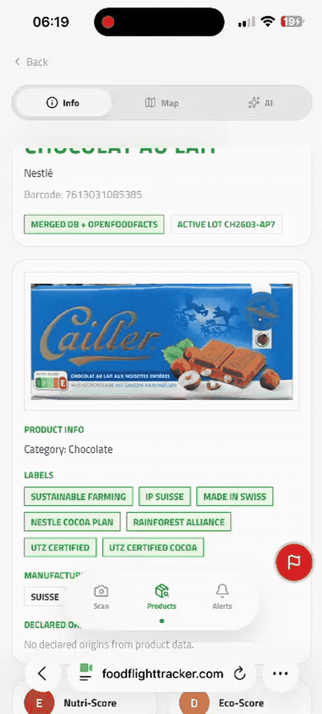
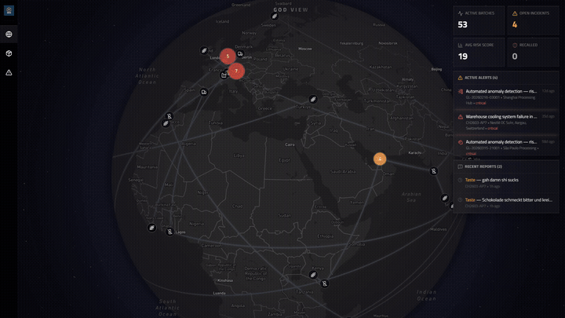
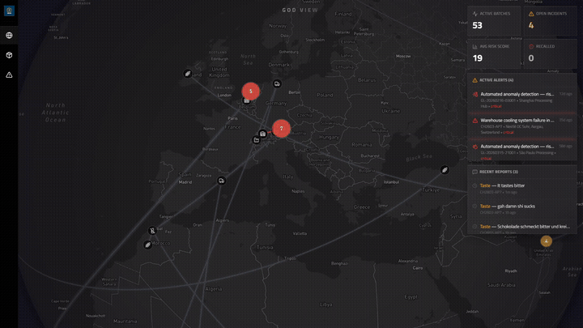
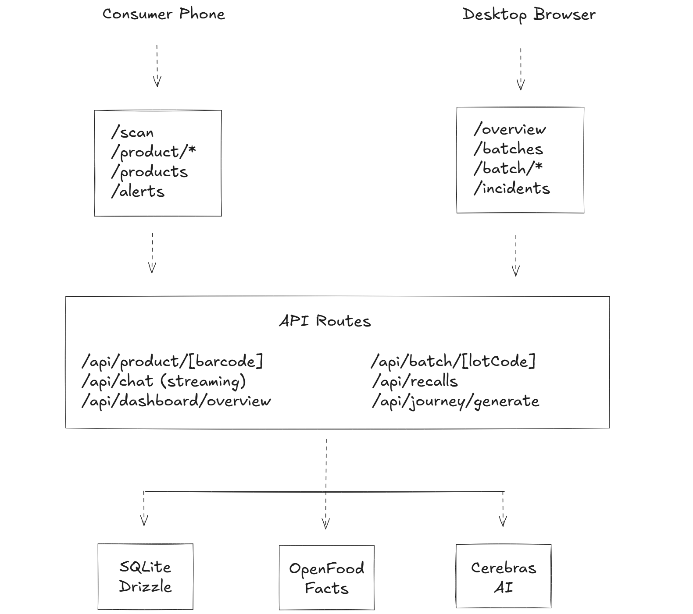

<h1 align="center">
  
  <br/>
  Project Trace — Food Flight Tracker
</h1>

<p align="center">
  Verfolge dein Essen vom Feld bis ins Regal.<br/>
  Gebaut am <strong>Baden Hackt 2026</strong>.
</p>

<p align="center">
  <a href="https://foodflighttracker.com"></a>
  <a href="https://github.com/Nepomuk5665/food-flight-tracker/tree/main/docs"></a>
  <a href="https://www.figma.com/design/4XAMeiD6nuGZ4HwsxqE1gT/Untitled?node-id=0-1&p=f"></a>
</p>

---

## Hallo Jury!

Project Trace hat zwei Seiten: eine **Consumer App** fürs Handy und ein **QA Dashboard** für den Desktop. Hier zeigen wir euch in 6 kurzen Demos, was die App kann.

> Barcode zum Ausprobieren: **`7613031085385`** — oder scannt den QR-Code weiter unten.

---

### 1 — Das QA Dashboard

Öffnet [foodflighttracker.com/overview](https://foodflighttracker.com/overview) auf dem Desktop. Der Globus zeigt alle Lieferketten in Echtzeit — klickt auf einen Alert und die Karte fliegt hin.

<p align="center">
  
</p>

---

### 2 — Produkt scannen & Reise verfolgen

Öffnet [foodflighttracker.com/scan](https://foodflighttracker.com/scan) auf dem Handy (oder QR-Code scannen). Barcode `7613031085385` eingeben — ihr seht die komplette Reise der Schokolade von der Elfenbeinküste bis München.

<p align="center">
  
</p>

<p align="center">
  
</p>

---

### 3 — Problem melden

Schokolade schmeckt komisch? Über den roten Button unten rechts könnt ihr direkt ein Problem melden.

<p align="center">
  
</p>

---

### 4 — Meldung im Dashboard

Die Meldung taucht sofort im QA Dashboard unter Incidents auf.

<p align="center">
  
</p>

---

### 5 — Rückruf auslösen

Das QA-Team kann direkt aus der Meldung heraus einen Rückruf triggern.

<p align="center">
  
</p>

---

### 6 — Rückruf beim Konsumenten

Der Konsument sieht den Rückruf sofort in der App unter Alerts.

<p align="center">
  
</p>

---

## Demo-Daten

| Produkt | Barcode | Charge | Besonderheit |
|---------|---------|--------|-------------|
| Chocolat au lait (Nestlé) | `7613031085385` | `CH2603-AP7` | 8 Stationen, 3 Länder, Hitze-Anomalie |
| Allgäuer Bio-Bergkäse | `4099887766550` | `K-MAKE-001` | 2 Höfe -> 1 Charge -> 2 Produkte |

Jeder andere echte Barcode wird über [OpenFoodFacts](https://world.openfoodfacts.org/) geladen (3 Mio.+ Produkte).

---

## Tech Stack

| Was | Womit |
|-----|-------|
| Framework | Next.js 16, TypeScript, Tailwind v4 |
| Datenbank | SQLite + Drizzle ORM |
| KI | Cerebras (~2.000 Tokens/Sek.) via Vercel AI SDK |
| Scanner | ZXing C++ via WebAssembly |
| Karten | Mapbox GL JS |
| Produktdaten | OpenFoodFacts API |
| Deployment | AWS EC2, Docker, Caddy (Auto-HTTPS) |

## Architektur

<p align="center">
  
</p>

Zwei Route Groups, eine App: `(consumer)/` fürs Handy und `(dashboard)/` für den Desktop. Herkunftsdaten werden über FAO/USDA-Handelsanteile aus den Zutaten abgeleitet.

## Lokal starten

```bash
git clone https://github.com/Nepomuk5665/food-flight-tracker.git
cd food-flight-tracker
pnpm install
cp .env.example .env.local   # CEREBRAS_API_KEY + NEXT_PUBLIC_MAPBOX_TOKEN eintragen
pnpm db:push && pnpm db:seed
pnpm dev
```

---

<p align="center">
  <strong>Baden Hackt 2026</strong> · Powered by Autexis
</p>
