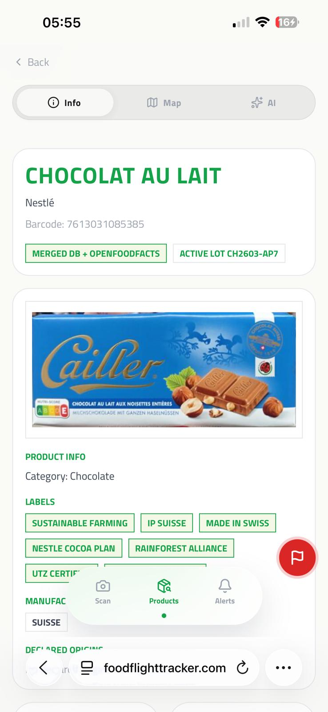
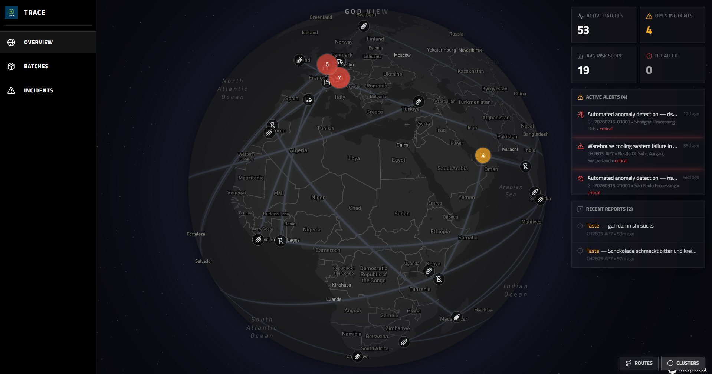
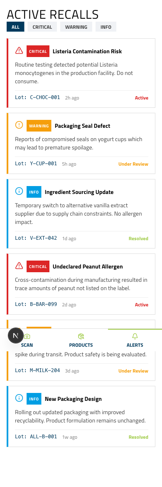

<h1 align="center">
  
  <br/>
  Project Trace — Food Flight Tracker
</h1>

<p align="center">
  Verfolge dein Essen vom Feld bis ins Regal.<br/>
  Gebaut am <strong>Baden Hackt 2026</strong>.
</p>

<p align="center">
  <a href="https://foodflighttracker.com"></a>
  <a href="https://github.com/Nepomuk5665/food-flight-tracker/tree/main/docs"></a>
  <a href="https://www.figma.com/design/4XAMeiD6nuGZ4HwsxqE1gT/Untitled?node-id=0-1&p=f"></a>
</p>

<p align="center">
  
  &nbsp;&nbsp;&nbsp;&nbsp;
  
</p>

---

## Hallo Jury!

Project Trace hat zwei Seiten: eine **Consumer App** (Handy) und ein **QA Dashboard** (Desktop). Probiert am besten beides aus — dauert ca. 12 Minuten. Wenig Zeit? Macht 1, 2, 4 in 9 Min.

---

## 1 — God View (Desktop, 3 Min.)

Oeffnet [foodflighttracker.com/overview](https://foodflighttracker.com/overview) auf dem Desktop.

1. Der Globus laedt. Lieferketten-Routen zeichnen sich ueber Kontinente, gruene Partikel fliessen. Lasst es kurz wirken.
2. Rechts seht ihr Metriken und den Alert-Feed. Sucht den **kritischen Alert** fuer `CH2603-AP7`.
3. Klickt drauf — die Karte fliegt zur Schweiz/Muenchen, ein roter Ping pulsiert, das Batch-Detail faehrt rein (Risiko 62).
4. Klickt auf den **Kaese-Cluster bei Kempten** — der klappt auf und zeigt Lineage-Verbindungen.

---

## 2 — Schokoladen-Reise (Handy, 4 Min.)

Scannt den QR-Code oder oeffnet [foodflighttracker.com/scan](https://foodflighttracker.com/scan) auf dem Handy.

<p align="center">
  
</p>

1. Tippt auf **"Enter manually"** und gebt den Barcode ein: **`7613031085385`**
2. Ihr seht die Produktseite: Chocolat au lait von Nestle, Nutri-Score D, Allergene, Chargennummer `CH2603-AP7` mit Risiko 62.
3. Tippt auf **Map** — eine animierte Route zeichnet sich von der Elfenbeinkueste ueber Hamburg und die Schweiz bis Muenchen. 8 Stationen mit Icons.
4. Tippt auf den **Lager-Marker** (Station 6, Schweiz) — da war ein Temperaturausreisser: 32.6 C statt max. 20 C, fast 5 Stunden lang.
5. Tippt auf **Chat** — die KI analysiert automatisch die Charge. Probiert "Is this safe to eat?" — Antwort: Fettreif ist unschoen, aber unbedenklich.
6. Der **rote Button** unten rechts oeffnet ein Meldeformular. Waehlt "Bad Taste", kurz beschreiben, absenden.

> Falls die KI nicht erreichbar ist: Schritte 5-6 ueberspringen, Karte und Scanner funktionieren trotzdem.

---

## 3 — Batch-Forensik (Desktop, 3 Min.)

Gleiche Charge, jetzt aus QA-Sicht.

1. Oeffnet [foodflighttracker.com/batch/CH2603-AP7](https://foodflighttracker.com/batch/CH2603-AP7) — Risiko-Gauge, Journey Map im Dark Theme.
2. **Telemetry**-Tab: Temperatur-Balken pro Station. Lager-Station durchbricht die rote Schwelle bei 20 C deutlich.
3. Wechselt zu [foodflighttracker.com/batch/K-MAKE-001](https://foodflighttracker.com/batch/K-MAKE-001) (Kaese, Risiko 12). **Lineage**-Tab: 2 Hoefe -> 1 Charge -> 2 Produkte.
4. Zurueck zu CH2603-AP7, **AI Analysis**-Tab: Die KI streamt eine Risikobewertung. Fragt "Should we issue a recall?" — differenzierte Antwort.

---

## 4 — Rueckruf (Desktop + Handy, 2 Min.)

1. Oeffnet [foodflighttracker.com/incidents](https://foodflighttracker.com/incidents) — klickt **"Trigger Recall"** bei CH2603-AP7.
2. Grund eingeben (z.B. "Temperature excursion caused fat bloom"), Severity High, absenden.
3. Wechselt aufs Handy: [foodflighttracker.com/alerts](https://foodflighttracker.com/alerts) — der Rueckruf erscheint sofort als Alert.

<p align="center">
  
</p>

---

## Demo-Daten

| Produkt | Barcode | Charge | Besonderheit |
|---------|---------|--------|-------------|
| Chocolat au lait (Nestle) | `7613031085385` | `CH2603-AP7` | 8 Stationen, 3 Laender, Hitze-Anomalie, Risiko 62 |
| Allgaeuer Bio-Bergkaese | `4099887766550` | `K-MAKE-001` | 2 Hoefe -> 1 Charge -> 2 Produkte |

Jeder andere echte Barcode wird ueber [OpenFoodFacts](https://world.openfoodfacts.org/) geladen (3 Mio.+ Produkte, aber ohne Lieferkettendaten).

---

## Tech Stack

| Was | Womit |
|-----|-------|
| Framework | Next.js 16, TypeScript, Tailwind v4 |
| Datenbank | SQLite + Drizzle ORM |
| KI | Cerebras (~2.000 Tokens/Sek.) via Vercel AI SDK |
| Scanner | ZXing C++ via WebAssembly |
| Karten | Mapbox GL JS |
| Produktdaten | OpenFoodFacts API |
| Deployment | AWS EC2, Docker, Caddy (Auto-HTTPS) |
| CI/CD | GitHub Actions -> ECR -> SSH |

## Architektur

<p align="center">
  
</p>

Zwei Route Groups, eine App: `(consumer)/` fuer Handy (Scan, Products, Alerts) und `(dashboard)/` fuer Desktop (Overview, Batches, Incidents). Herkunftsdaten werden ueber FAO/USDA-Handelsanteile aus den Zutaten abgeleitet — keine API liefert das.

## Lokal starten

```bash
git clone https://github.com/Nepomuk5665/food-flight-tracker.git
cd food-flight-tracker
pnpm install
cp .env.example .env.local   # CEREBRAS_API_KEY + NEXT_PUBLIC_MAPBOX_TOKEN eintragen
pnpm db:push && pnpm db:seed
pnpm dev
```

---

<p align="center">
  <strong>Baden Hackt 2026</strong> · Powered by Autexis
</p>
