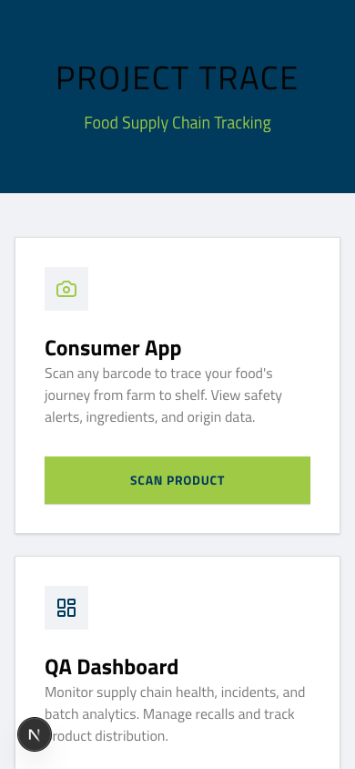
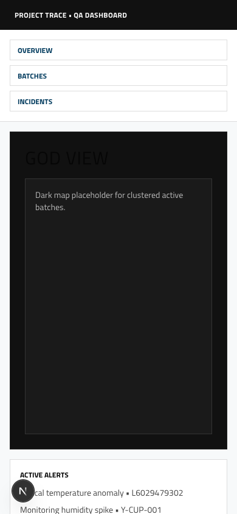
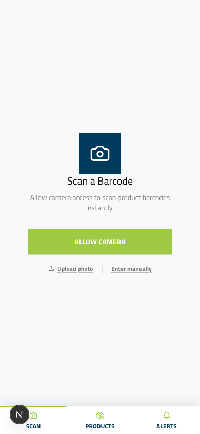

<h1 align="center">
  
  <br/>
  Project Trace — Food Flight Tracker
</h1>

<p align="center">
  <em>Track your food from field to shelf.</em><br/>
  Real-time supply chain visibility, AI-powered safety analysis, and barcode scanning.<br/>
  Built for <strong>Baden Hackt 2026</strong>.
</p>

<p align="center">
  <a href="https://foodflighttracker.com"></a>
  <a href="https://github.com/Nepomuk5665/food-flight-tracker/tree/main/docs"></a>
  <a href="https://www.figma.com/design/4XAMeiD6nuGZ4HwsxqE1gT/Untitled?node-id=0-1&p=f"></a>
</p>

---

## Hey there, Reviewer!

Thanks for checking out **Project Trace**! We built this in 24 hours and we're really proud of it. This README is your personal guided tour — it'll walk you through everything step by step, starting simple and building up to the cool stuff.

**Total tour time: ~12 minutes** (or ~9 min if you're in a hurry).

The app has two sides:

| Side | Who it's for | Open on | URL |
|------|-------------|---------|-----|
| **Consumer App** | Shoppers who want to know where their food comes from | Your phone (or mobile emulation) | [foodflighttracker.com](https://foodflighttracker.com) |
| **QA Dashboard** | Food safety teams monitoring supply chains | Your desktop browser | [foodflighttracker.com/overview](https://foodflighttracker.com/overview) |

<p align="center">
  
  &nbsp;&nbsp;&nbsp;&nbsp;
  
</p>

Ready? Let's go!

---

## The Guided Tour

We've designed this tour to build up gradually — start with the impressive bird's-eye view, then zoom into the consumer story, drill into the QA tools, and finish with the full recall workflow. Each scenario builds on the last.

> **Short on time?** Do Scenarios 1, 2, and 4 (skip 3) for a 9-minute version.

---

### Scenario 1: God View — The Command Center
**~3 min | Desktop | Low risk (no external dependencies)**

*You're a QA director. You've just opened your morning dashboard. Let's see what's happening across your supply chains.*

<table>
<tr><th>Step</th><th>What to do</th><th>What you'll see</th></tr>
<tr>
  <td><strong>1</strong></td>
  <td>Open <a href="https://foodflighttracker.com/overview">foodflighttracker.com/overview</a> on your desktop</td>
  <td>A dark globe loads with an atmosphere effect. Supply chain arcs draw across continents with green flow particles streaming along the routes. Let it breathe for a few seconds — it's pretty.</td>
</tr>
<tr>
  <td><strong>2</strong></td>
  <td>Look at the metrics panel and alert feed</td>
  <td>Batch count, anomaly count, risk breakdown. The alert feed shows severity-coded badges — look for the critical one.</td>
</tr>
<tr>
  <td><strong>3</strong></td>
  <td>Click the <strong>critical alert</strong> for batch <code>CH2603-AP7</code></td>
  <td>Cinematic fly-to animation zooms to Switzerland/Munich (72-degree tilt, 2 seconds). A red ping pulses at the anomaly location. The batch detail panel slides in showing lot code <code>CH2603-AP7</code> and a risk gauge at 62.</td>
</tr>
<tr>
  <td><strong>4</strong></td>
  <td>Click the cheese cluster near Kempten</td>
  <td>The cluster expands showing cheese batches. Lineage edges draw between them showing merge/split relationships.</td>
</tr>
</table>

> *"Every batch, every route, every anomaly — in real time."*

---

### Scenario 2: Consumer Scanning — The Chocolate Journey
**~4 min | Mobile (or mobile emulation) | Medium risk (needs Mapbox + Cerebras)**

*A consumer buys a chocolate bar at REWE Munich. It tastes a bit off — bitter and chalky. They want to know why. Let's trace its journey.*

**Setup:** Use your phone, or open Chrome DevTools and switch to mobile emulation (iPhone 14 Pro). The app detects mobile user agents.

#### Step 1: Get to the scanner

Scan this QR code with your phone to jump straight to the scanner:

<p align="center">
  
  <br/>
  <em>Opens foodflighttracker.com/scan</em>
</p>

Or just open [foodflighttracker.com/scan](https://foodflighttracker.com/scan) directly.

<p align="center">
  
</p>

#### Step 2: Enter the chocolate barcode

Tap **"Enter manually"** at the bottom of the scan screen. A drawer slides up with an input field.

Type this barcode and tap Go:

```
7613031085385
```

> This is our demo chocolate: **Chocolat au lait** by Nestle, with a full 8-stage supply chain seeded into the database. It's the star of the show.

#### Step 3: Explore the product page

You land on the product info tab. Take a look around:

- **Product**: "Chocolat au lait" by Nestle
- **Scores**: Nutri-Score D, Eco-Score C
- **Allergens**: milk, soy (highlighted in red)
- **Lot code**: `CH2603-AP7` — risk score 62 (amber)
- A **red report button** pulses in the bottom-right corner

#### Step 4: The Map tab (the money shot)

Tap the **Map** tab. Watch closely:

1. A ghost dashed line appears showing the planned route
2. Then over ~4 seconds, an animated green glowing line draws from **Ivory Coast** across the Atlantic to **Hamburg**, then to **Switzerland**, then to **Munich**
3. Eight stage markers appear along the route (harvest, ship, train, factory, warehouse, truck, store)
4. Great-circle arcs curve beautifully over the ocean

> *From a cocoa cooperative in Ivory Coast to a shelf in Munich — visualized.*

#### Step 5: Find the anomaly

Tap the **warehouse marker** (stage 6, in Switzerland). A popup appears:

> "Distribution Warehouse — Nestle DC Suhr"
> **CRITICAL** — 32.6 C peak, threshold 20 C, 285 min

That's a temperature excursion. The chocolate sat in a hot warehouse for almost 5 hours. That's why it tastes off.

#### Step 6: Timeline view

Tap the **timeline toggle** (list icon). A bottom drawer shows all 8 stages chronologically. Stage 6 has a red anomaly indicator.

#### Step 7: Ask the AI

Tap the **Chat** tab. The AI auto-loads with context about this specific batch. It streams a response mentioning the temperature excursion, fat bloom risk, and the 62 risk score.

Tap the suggestion chip: **"Is this safe to eat?"**

The AI explains: fat bloom (the white chalky coating) is a quality defect from melted and re-solidified cocoa butter — not a safety hazard. Your chocolate is ugly but safe.

#### Step 8: File a report

Tap the **red report button** in the bottom-right. A report sheet slides up. Tap **"Bad Taste"**, type a short complaint, and submit. The report is filed with AI context attached.

> *"One scan — from a cooperative in Ivory Coast to the shelf in Munich. The AI connects 'it tastes funny' to a warehouse cooling failure 6 weeks ago."*

> **If Cerebras AI is down:** Skip steps 7-8. The map, telemetry, and scanning all work without it.

---

### Scenario 3: Batch Forensics — QA Deep Dive
**~3 min | Desktop | Medium risk (needs Mapbox + Cerebras)**

*Same batch, different perspective. Now you're the QA analyst. Time to dig into telemetry, lineage, and get an AI recommendation.*

<table>
<tr><th>Step</th><th>What to do</th><th>What you'll see</th></tr>
<tr>
  <td><strong>1</strong></td>
  <td>Open <a href="https://foodflighttracker.com/batch/CH2603-AP7">foodflighttracker.com/batch/CH2603-AP7</a></td>
  <td>Batch header: "Chocolat au lait", ACTIVE badge, risk gauge animates to 62 (orange).</td>
</tr>
<tr>
  <td><strong>2</strong></td>
  <td>Look at the <strong>Journey Map</strong> tab (default)</td>
  <td>Same Mapbox journey but now in the dark dashboard theme. Stage markers + animated route.</td>
</tr>
<tr>
  <td><strong>3</strong></td>
  <td>Click the <strong>Telemetry</strong> tab</td>
  <td>Temperature range bars per stage. The warehouse stage has a red ANOMALY badge — the bar stretches from 16 C to 32.6 C, clearly breaching the red threshold line at 20 C.</td>
</tr>
<tr>
  <td><strong>4</strong></td>
  <td>Navigate to <a href="https://foodflighttracker.com/batch/K-MAKE-001">foodflighttracker.com/batch/K-MAKE-001</a></td>
  <td>Different product: "Allgau Bio-Bergkase" (cheese), risk 12 (green). Clean batch.</td>
</tr>
<tr>
  <td><strong>5</strong></td>
  <td>Click the <strong>Lineage</strong> tab</td>
  <td>Flow diagram: two farms (K-FARM-H 57% + K-FARM-S 43%) merge into K-MAKE-001, which splits into K-SLICE-001 (80%) and K-WHEEL-001 (20%). Clickable boxes.</td>
</tr>
<tr>
  <td><strong>6</strong></td>
  <td>Go back to <code>CH2603-AP7</code>, click <strong>AI Analysis</strong> tab</td>
  <td>Auto-prompt fires: "Analyze this batch." AI streams a risk assessment with temperature excursion details, consumer report correlation, and a recall recommendation.</td>
</tr>
<tr>
  <td><strong>7</strong></td>
  <td>Type: <em>"Should we issue a recall?"</em></td>
  <td>Nuanced response: quality hold vs. full recall, fat bloom isn't a safety hazard — but the brand reputation damage might warrant action.</td>
</tr>
</table>

> *"From telemetry to lineage to AI-assisted decision making — the QA team has everything in one view."*

---

### Scenario 4: Recall Workflow — Closing the Loop
**~2 min | Desktop + Mobile | Low risk (all local, no external APIs)**

*The QA director decides to trigger a recall. Let's see how fast the consumer gets notified.*

<table>
<tr><th>Step</th><th>What to do</th><th>What you'll see</th></tr>
<tr>
  <td><strong>1</strong></td>
  <td>Open <a href="https://foodflighttracker.com/incidents">foodflighttracker.com/incidents</a> on desktop</td>
  <td>Consumer Reports section shows the CH2603-AP7 report (taste_quality). There's a "Trigger Recall" button.</td>
</tr>
<tr>
  <td><strong>2</strong></td>
  <td>Click <strong>"Trigger Recall"</strong> on the CH2603-AP7 row</td>
  <td>A form opens. Lot code is pre-filled.</td>
</tr>
<tr>
  <td><strong>3</strong></td>
  <td>Type reason: <em>"Temperature excursion caused fat bloom"</em>, set severity to High, submit</td>
  <td>The recall appears in Active Recalls: red border, HIGH badge, reason text, affected lot.</td>
</tr>
<tr>
  <td><strong>4</strong></td>
  <td>Switch to mobile: <a href="https://foodflighttracker.com/alerts">foodflighttracker.com/alerts</a></td>
  <td>An alert card appears with the recall reason, lot code, and severity badge. The consumer is notified instantly.</td>
</tr>
</table>

<p align="center">
  
</p>

> *"From consumer report to recall to notification — the loop is closed."*

---

## Seed Data Cheat Sheet

Our database is pre-seeded with two complete supply chains you can explore:

| Product | Barcode | Key Lot Code | Stages | What's special |
|---------|---------|-------------|--------|----------------|
| **Chocolat au lait** (Nestle) | `7613031085385` | `CH2603-AP7` | 8 stages across 3 countries | Warehouse heat anomaly, risk 62, consumer report |
| **Allgau Bio-Bergkase** (AlpenMilch) | `4099887766550` | `K-MAKE-001` | 3 stages + lineage | 2 farms merge into 1 batch, then split into 2 products |

You can also scan **any real barcode** — the app falls back to [OpenFoodFacts](https://world.openfoodfacts.org/) (3M+ products) for product info, though those won't have supply chain data.

---

## Tech Stack

| Layer | Technology |
|-------|-----------|
| Framework | Next.js 16 (App Router, Turbopack) |
| Language | TypeScript |
| Styling | Tailwind CSS v4 + Autexis corporate design |
| Database | SQLite + Drizzle ORM (WAL mode) |
| AI | Cerebras (~2,000 tokens/sec) via Vercel AI SDK |
| Scanner | barcode-detector (ZXing C++ via WebAssembly) |
| Maps | Mapbox GL JS + react-map-gl |
| Product Data | OpenFoodFacts API |
| Deployment | AWS EC2 + Docker + Caddy (auto-HTTPS) |
| CI/CD | GitHub Actions -> ECR -> SSH deploy |

---

## Architecture

<p align="center">
  
</p>

Two route groups serve two audiences from a single Next.js app:

- **`(consumer)/`** — Mobile-first PWA. Bottom tab nav: Scan, Products, Alerts. Max-width 480px.
- **`(dashboard)/`** — Desktop QA dashboard. Sidebar nav: Overview, Batches, Incidents.

Data flows from barcode scan -> OpenFoodFacts API -> local SQLite DB -> journey map with seeded supply chain telemetry.

### Origin Intelligence

No public API provides per-ingredient geographic origins. Our **Origin Intelligence layer** (`src/lib/origin/`) infers likely source countries from ingredient lists using FAO/USDA global trade share data (e.g., cocoa -> 38% Ivory Coast, 17% Ghana), then constructs synthetic journeys with geocoded waypoints: harvest -> transport -> processing -> storage -> retail.

### AI Integration

We use **Cerebras** because nobody wants to wait for AI. At ~2,000 tokens/second, responses stream instantly — no spinners, no "generating..." screens. The AI is context-aware: it knows the product's ingredients, scores, supply chain stages, and anomalies for each specific batch.

---

## Local Development

```bash
# Clone
git clone https://github.com/Nepomuk5665/food-flight-tracker.git
cd food-flight-tracker

# Install
pnpm install

# Environment
cp .env.example .env.local
# Add your keys to .env.local:
#   CEREBRAS_API_KEY=csk-...
#   NEXT_PUBLIC_MAPBOX_TOKEN=pk.eyJ...

# Database
pnpm db:push    # Create tables
pnpm db:seed    # Seed demo data (chocolate + cheese supply chains)

# Run
pnpm dev        # http://localhost:3000
```

---

## Infrastructure

<p align="center">
  
</p>

One-push deployment: GitHub Actions -> ECR -> EC2 with auto-HTTPS via Caddy + Let's Encrypt. SQLite persisted on a Docker volume.

---

<p align="center">
  <strong>Built with care at Baden Hackt 2026</strong><br/>
  Powered by Autexis
</p>
